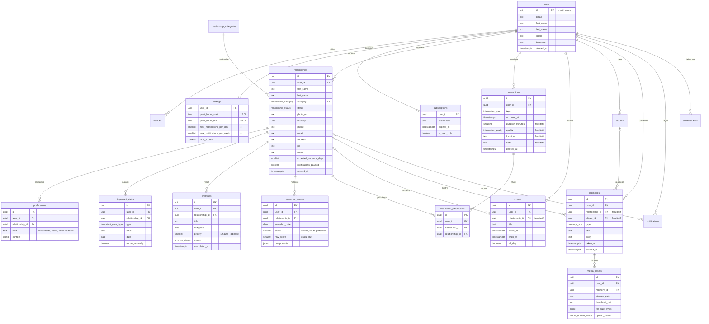

# Sprint 0 — Livrable 4 : Schéma de données

* **Statut : définitif** (référence pour le développement)
* **Date :** juillet 2026
* **Cible :** PostgreSQL 15 / Supabase
* **Script associé :** [`04-schema.sql`](04-schema.sql) — schéma complet exécutable (vérifié sur un cluster PostgreSQL vierge avec bouchon du schéma `auth`)
* **Références :** [PRD V1.2](../prd-v1.2.md) · [Audit, chapitre 07 — Architecture technique](../audit/07-architecture-technique.md) · [Audit, chapitre 06 — Indice de présence](../audit/06-score-relationnel-et-gamification.md)

---

## 1. Principes de conception

### 1.1 Identifiants UUID générés côté client

Toutes les clés primaires sont des UUID. C'est la condition du fonctionnement hors ligne : l'application crée une relation, une interaction ou un souvenir au sommet d'une montagne, avec un identifiant définitif, sans attendre le serveur. Les UUID clients éliminent toute collision à la synchronisation. Chaque table conserve néanmoins un `DEFAULT gen_random_uuid()` en filet de sécurité pour les écritures serveur.

### 1.2 Suppression logique (`deleted_at`)

Aucune donnée n'est effacée physiquement par l'application. Supprimer, c'est poser `deleted_at` : la suppression devient une simple mise à jour, qui se synchronise entre appareils comme n'importe quelle écriture, et qui reste réversible pendant 30 jours. La purge physique est une tâche serveur quotidienne (§ 5).

### 1.3 `updated_at` et « dernière écriture gagne »

Chaque table porte `created_at` et `updated_at`. Un trigger serveur (`set_updated_at`) écrase systématiquement `updated_at` avec l'horloge du serveur à chaque écriture : c'est la version de référence de la synchronisation. Les horloges des téléphones — souvent fausses — ne sont jamais comparées entre elles (§ 7).

### 1.4 `user_id` partout, Row Level Security systématique

Toutes les tables porteuses de données personnelles ont une colonne `user_id` (dénormalisée si nécessaire, comme sur `interaction_participants`), ce qui permet des politiques RLS sans jointure : `auth.uid() = user_id`. Même en cas de bug applicatif, aucune requête ne peut lire ou écrire les données d'un autre utilisateur. Unique exception assumée : `relationship_categories`, référentiel partagé en lecture seule.

Trois familles de politiques :

| Famille | Tables | Politiques |
|---|---|---|
| Contenu utilisateur | `relationships`, `preferences`, `important_dates`, `interactions`, `interaction_participants`, `events`, `promises`, `albums`, `memories`, `media_assets`, `devices` | `select` / `insert` / `update` / `delete`, toutes restreintes à `auth.uid() = user_id` |
| Profil et paramètres | `users`, `settings` | `select` / `insert` / `update` (la suppression de compte passe par le serveur) |
| Écrites par le serveur | `presence_scores`, `achievements`, `subscriptions` (lecture seule) ; `notifications` (lecture + marquage « ouverte ») | Le client **lit** ses lignes ; l'absence volontaire de politique d'écriture vaut interdiction. Décision de sécurité : un client ne doit pas pouvoir falsifier son indice, ses badges ni son droit d'abonnement. Les écritures viennent des tâches serveur et du webhook RevenueCat, qui contournent la RLS par construction. |

### 1.5 Énumérations : identifiants anglais, libellés français

Les valeurs stockées sont des identifiants anglais stables (`call`, `partner`, `in_memoriam`…) ; les libellés français vivent côté application (et, pour les catégories, dans le référentiel `relationship_categories.label_fr`). Le tableau complet des correspondances figure au § 4.

### 1.6 Le serveur calcule, le client consigne

Le client est maître de la **saisie** (relations, interactions, souvenirs, promesses) ; le serveur est maître des **dérivés** : indice de présence quotidien, notifications, badges, statut d'abonnement. Les statistiques ne sont pas stockées : elles se calculent depuis les interactions (décision T-05 de l'audit). La « ligne de vie » n'est pas une table : c'est une vue chronologique construite à partir des souvenirs, des dates importantes et des interactions marquantes.

---

## 2. Diagramme entité-relation

---

## 3. Description des tables

### 3.1 Identité et compte

#### `users`
**Rôle.** Profil applicatif ; complète `auth.users` (géré par Supabase Auth), avec lequel il partage l'identifiant. Une ligne est créée automatiquement à l'inscription (trigger `handle_new_user`), en même temps que la ligne `settings`.
**Champs notables.** `locale` (défaut `fr`) ; `timezone` (défaut `Europe/Zurich`) — indispensable pour envoyer les notifications « à la bonne heure » locale ; `deleted_at` posé à la demande de suppression du compte (délai de grâce de 30 jours).
**Règles métier.** La suppression du compte est pilotée par le serveur : jamais de politique `delete` côté client.

#### `devices`
**Rôle.** Table technique : appareils de l'utilisateur, jetons push (FCM/APNs) et point de contrôle de synchronisation (`last_synced_at`). Nécessaire au moteur de notifications serveur et au multi-appareil.
**Règles métier.** Un jeton push peut être nul (permission refusée) ; la déduplication des jetons se fait à l'envoi.

#### `settings`
**Rôle.** Paramètres utilisateur, une ligne par compte, créée à l'inscription.
**Champs notables.** Heures silencieuses `quiet_hours_start`/`quiet_hours_end` (défaut **22 h → 8 h**, plage à cheval sur minuit gérée par la logique serveur) ; plafonds `max_notifications_per_day` (**2**) et `max_notifications_per_week` (**6**) ; `hide_scores` (remplace les indices chiffrés par les états qualitatifs — garde-fou éthique du chapitre 06) ; `extra` JSONB pour les réglages additionnels sans migration.

#### `subscriptions`
**Rôle.** Cache du statut RevenueCat (source de vérité : RevenueCat, répliqué par webhook). Une ligne par utilisateur.
**Champs notables.** `entitlement`, `store`, `is_trial`, `expires_at`, et surtout `is_read_only` : vrai après expiration, l'utilisateur peut consulter, exporter, supprimer — plus créer ni modifier (PRD, mode lecture seule).
**Règles métier.** Écrite exclusivement par le webhook (rôle service) : un client ne peut pas se fabriquer un abonnement.

### 3.2 Relations

#### `relationship_categories`
**Rôle.** Référentiel des sept catégories : libellé français et **cadence d'interaction attendue par défaut**, en jours.

| Catégorie | Identifiant | Cadence par défaut |
|---|---|---|
| Partenaire | `partner` | 2 jours |
| Enfants | `child` | 3 jours |
| Famille | `family` | 7 jours |
| Amis | `friend` | 14 jours |
| Mentor | `mentor` | 30 jours |
| Professionnel | `professional` | 30 jours |
| Autres | `other` | 30 jours |

**Règles métier.** Table partagée, lecture seule pour les clients ; écriture réservée aux migrations. C'est l'exception au principe « `user_id` partout ».

#### `relationships`
**Rôle.** La « personne » du produit : table centrale, toutes les autres données de contenu s'y rattachent.
**Champs notables.** Identité complète du PRD (`first_name` obligatoire, `last_name`, `photo_url`, `birthday`, `phone`, `email`, `address`, `job`, `notes`) ; `category` (FK vers le référentiel) ; `status` (`active` / `archived` / `in_memoriam`, § 6) ; `expected_cadence_days`, cadence attendue **personnalisable par relation** (« je veux appeler papa chaque semaine »), remplie automatiquement depuis le référentiel si absente (trigger `set_default_cadence` — envoyer `null` revient au défaut de la catégorie) ; `notifications_paused` pour suspendre les rappels d'une seule relation sans l'archiver.
**Règles métier.** La cadence nourrit l'indice de présence et les seuils de relance relatifs (« à entretenir » au-delà de 2× la cadence — chapitre 06) ; l'anniversaire saisi ici est dupliqué par l'application en `important_dates` (type `birthday`) pour alimenter calendrier et rappels.

#### `preferences`
**Rôle.** Préférences d'une relation, une ligne par domaine : restaurants, loisirs, films, musique, couleurs, fleurs, parfums, idées cadeaux, notes diverses.
**Champs notables.** `kind` (contrainte CHECK sur les neuf domaines) ; `content` JSONB — tableau libre de chaînes ou d'objets `{label, note, url}`.
**Règles métier.** Unicité `(relationship_id, kind)` **partielle** (hors lignes supprimées) : une ligne par domaine et par relation, granularité adaptée à la résolution de conflit ligne à ligne.

#### `important_dates`
**Rôle.** Dates importantes d'une relation : anniversaire, première rencontre, premier rendez-vous, mariage, fiançailles, naissance, diplôme, événement personnalisé. Alimente le calendrier, la ligne de vie et les rappels.
**Champs notables.** `recurs_annually` (vrai par défaut) ; `label` obligatoire quand `type = 'custom'` (contrainte CHECK).
**Règles métier.** Index d'expression sur (mois, jour) pour le balayage quotidien des anniversaires par le moteur de notifications.

### 3.3 Activité

#### `interactions`
**Rôle.** Le cœur du produit : un fait **passé** (« Ajouter une interaction », complétion cible < 10 secondes). Alimente l'indice, l'historique, les statistiques et la fonction « Souvenir du jour ».
**Champs notables.** `type` (10 valeurs officielles) et participants obligatoires ; tout le reste facultatif : `occurred_at` (défaut : maintenant, rétrodatable), `duration_minutes`, `quality`, `location`, `note`.
**Règles métier.** Le passé consigné vit ici ; le futur planifié vit dans `events` (décision T-03 de l'audit). Une interaction sans plus aucun participant actif est supprimée logiquement (§ 5).

#### `interaction_participants`
**Rôle.** Table de liaison : participants d'une interaction. Un repas de famille concerne papa, maman et grand-maman **en une seule saisie**.
**Champs notables.** `user_id` dénormalisé pour porter la RLS sans jointure ; unicité partielle `(interaction_id, relationship_id)`.

#### `events`
**Rôle.** Événement de calendrier **planifié** (vues jour/semaine/mois) : sortie prévue, voyage, rendez-vous.
**Champs notables.** `relationship_id` facultatif (événement personnel possible) ; `starts_at` / `ends_at` (CHECK de cohérence) ; `all_day`.
**Règles métier.** Un événement réalisé génère une interaction — logique applicative, pas de statut en base en V1. Les anniversaires et dates importantes ne sont pas copiés ici : le calendrier les projette depuis `important_dates`.

#### `promises`
**Rôle.** Promesses faites à une relation (« réserver un restaurant avec Emma »), affichées dans le calendrier et comptées dans l'indice.
**Champs notables.** `due_date` facultative ; `priority` (1 haute · 2 normale · 3 basse) ; `status` (`todo` / `in_progress` / `done`) ; `completed_at`.
**Règles métier.** Contrainte CHECK : `status = 'done'` si et seulement si `completed_at` est renseigné.

### 3.4 Souvenirs

#### `albums`
**Rôle.** Conteneurs de souvenirs, nommés et décrits. La couverture est déterminée côté application (premier média), sans FK circulaire.

#### `memories`
**Rôle.** Le journal de souvenirs : photos, notes, albums de moments. Matière première de la chronologie, de la ligne de vie et du « Souvenir du jour ».
**Champs notables.** `type` (`photo` / `note` / `album`) ; `taken_at`, date du souvenir, rétrodatable — distincte de `created_at`, date de saisie ; `relationship_id` facultatif (souvenir personnel possible) ; `album_id` facultatif.
**Règles métier.** Un souvenir supprimé emporte ses médias (trigger de cascade logique) ; un album supprimé **ne supprime pas** ses souvenirs (FK `ON DELETE SET NULL` à la purge).

#### `media_assets`
**Rôle.** Fichiers d'un souvenir dans Supabase Storage (bucket privé, URL signées — jamais d'URL publique pour des photos de famille).
**Champs notables.** `storage_path` (unique) et `thumbnail_path` (miniature ~30 Ko générée côté client, clé de la fluidité des grilles) ; `mime_type`, `file_size_bytes`, `width`, `height` ; **`upload_status`** (`pending` / `uploaded` / `failed`) — la clé du hors-ligne : un média créé sans réseau est visible localement en `pending`, puis envoyé en tâche de fond avec reprise sur échec.
**Règles métier.** Index partiel sur les uploads en attente (file de reprise) ; les quotas et la compression relèvent du pipeline média (livrable dédié).

### 3.5 Moteur serveur

#### `presence_scores`
**Rôle.** Instantanés **quotidiens** de l'indice de présence, calculés par la tâche serveur — jamais par le client (décision T-09). Historique nécessaire au graphique d'évolution et à la règle de chute plafonnée.
**Champs notables.** `snapshot_date` (unicité par relation et par jour) ; `raw_score`, calcul brut de la formule ; `score`, valeur **affichée** après plafonnement de la chute à **−8 points par semaine** (tolérance à la sous-saisie, chapitre 06) ; `components` JSONB, détail des six composantes du PRD (dernière interaction 35 %, régularité 25 %, temps passé 15 %, promesses 10 %, souvenirs 10 %, dates importantes 5 %) pour l'historique et le débogage.
**Règles métier.** Lecture seule pour le client ; répliqué localement pour l'affichage hors ligne. Aucun instantané n'est produit pour les relations archivées ou en mémoire (§ 6).

#### `notifications`
**Rôle.** Journal des notifications **envoyées**. Sert à appliquer les plafonds (2/jour, 6/semaine, calculés sur ce journal), à éviter les redites et à mesurer l'engagement. Les préférences vivent dans `settings` (globales) et `relationships.notifications_paused` (par relation).
**Champs notables.** `kind` (nomenclature à figer avec le livrable notifications), `channel` (`push` / `email`), `sent_at`, `opened_at` (seul champ que le client met à jour).
**Règles métier.** Pas de suppression logique : c'est un journal. `relationship_id` passe à `null` si la relation est purgée (le journal survit).

#### `achievements`
**Rôle.** Succès débloqués — **préparatoire V1.1**, volontairement minimal : `code` du badge et `unlocked_at`, unicité par utilisateur et par code. Le référentiel des badges, l'XP et les défis viendront en V1.1 sans toucher aux tables V1.

---

## 4. Énumérations officielles

Identifiants anglais stockés en base, libellés français affichés par l'application.

| Type | Valeurs → libellés |
|---|---|
| `interaction_type` | `call` Appel · `message` Message · `meal` Repas · `outing` Sortie · `trip` Voyage · `visit` Visite · `gift` Cadeau · `moment` Moment ensemble · `photo` Photo souvenir · `event` Événement important |
| `relationship_category` | `partner` Partenaire · `family` Famille · `friend` Amis · `child` Enfants · `mentor` Mentor · `professional` Professionnel · `other` Autres |
| `relationship_status` | `active` Active · `archived` Archivée · `in_memoriam` En mémoire |
| `promise_status` | `todo` À faire · `in_progress` En cours · `done` Terminée |
| `interaction_quality` | `difficult` Difficile · `okay` Correct · `good` Bien · `excellent` Excellent |
| `memory_type` | `photo` Photo · `note` Note · `album` Album |
| `important_date_type` | `birthday` Anniversaire · `first_meeting` Première rencontre · `first_date` Premier rendez-vous · `wedding` Mariage · `engagement` Fiançailles · `birth` Naissance · `graduation` Diplôme · `custom` Personnalisé |
| `media_upload_status` (technique) | `pending` En attente d'envoi · `uploaded` Envoyé · `failed` Échec |

---

## 5. Règles de suppression

**Décision : suppression logique en cascade, purge définitive à J+30 par tâche serveur.**

### 5.1 Cascade logique immédiate

Supprimer un élément pose `deleted_at` sur lui **et sur ce qui n'a de sens que par lui**, avec le même horodatage (triggers en base, donc identiques quel que soit le client) :

| Suppression de… | Cascade logique |
|---|---|
| une **relation** | ses préférences, dates importantes, promesses, événements liés, souvenirs liés (et leurs médias), instantanés d'indice, participations aux interactions. Les **interactions partagées** avec d'autres relations sont conservées ; celles qui n'ont plus aucun participant actif sont supprimées logiquement. |
| une **interaction** | ses participations |
| un **souvenir** | ses fichiers médias |
| un **album** | rien — les souvenirs sont conservés (l'album n'est qu'un conteneur) |
| le **compte** | profil marqué supprimé ; purge intégrale à J+30 (RGPD / nLPD, délai de grâce) |

Les lignes supprimées logiquement sont invisibles pour l'interface (les index applicatifs sont partiels : `WHERE deleted_at IS NULL`) mais continuent de se synchroniser — c'est ainsi que les suppressions se propagent entre appareils.

### 5.2 Purge définitive à J+30

La fonction `purge_soft_deleted()` (SECURITY DEFINER, exécution révoquée pour les clients) supprime **physiquement** tout ce qui est supprimé logiquement depuis plus de 30 jours, ordre enfants → parents, les FK `ON DELETE CASCADE` garantissant l'intégrité. Elle traite aussi la suppression de compte : à l'issue du délai de grâce, la suppression de `auth.users` cascade sur l'intégralité du schéma. Planification quotidienne par `pg_cron` ou Edge Function planifiée ; dans les deux cas, les objets Supabase Storage des médias concernés sont effacés **avant** la purge SQL.

### 5.3 Restauration

Pendant 30 jours, restaurer = remettre `deleted_at` à `null`. L'horodatage commun de la cascade permet de restaurer une relation avec exactement ce qui a été supprimé avec elle (la restauration en cascade est applicative, § 8).

---

## 6. Règles d'archivage

Le statut vit sur `relationships.status` ; archiver n'est **pas** supprimer : toutes les données restent consultables.

### `archived` — relation mise de côté

* **Gel de l'indice** : la tâche quotidienne ignore les relations non actives ; plus aucun instantané n'est produit, le dernier reste consultable (l'indice ne « pourrit » pas pendant l'archivage).
* **Exclusion des notifications** : le moteur serveur ne considère que les relations `active` — plus de relances, plus de rappels d'anniversaire.
* Exclue des listes et statistiques par défaut ; **réactivable à tout moment** (le calcul de l'indice reprend, sans pénalité rétroactive grâce au plafonnement de chute).

### `in_memoriam` — personne décédée

Tout ce qui précède, plus les règles propres à la fonction « En mémoire » du PRD :

* **Notifications définitivement coupées**, y compris anniversaires — l'application ne doit jamais envoyer « Cela fait quelque temps que vous n'avez pas vu X » après un décès (garde-fou éthique majeur du chapitre 06).
* **Indice jamais réaffiché** : la fiche présente uniquement souvenirs, chronologie et dates, mis en valeur.
* La création de souvenirs et de notes **reste possible** : conserver l'histoire est précisément l'objet de la fonction.

---

## 7. Règles de synchronisation

Architecture hors-ligne d'abord (audit R3) : la base locale SQLite est la source de vérité de l'interface ; le réseau est un processus d'arrière-plan, jamais une condition de l'affichage.

1. **File de mutations locale.** Chaque écriture (création, modification, suppression logique) est appliquée immédiatement en local puis journalisée dans une file ordonnée (schéma côté application, hors périmètre de ce livrable). Les UUID clients rendent les rejeux idempotents (upsert par clé primaire).
2. **Poussée (push).** Au retour du réseau, les mutations sont rejouées vers Supabase dans leur ordre local. Aucune ne dépend d'un identifiant serveur : elles peuvent partir en lot.
3. **Résolution de conflit : dernière écriture gagne, par ligne.** Les données sont mono-utilisateur ; les conflits ne surviennent qu'entre appareils du même compte. La dernière mutation **arrivée au serveur** gagne, à la granularité de la ligne — suffisant en V1 (décision de l'audit, à réévaluer pour le partage familial).
4. **L'horloge serveur fait foi.** Le trigger `set_updated_at` écrase toute valeur cliente de `updated_at` : la version d'une ligne est datée par le serveur, jamais par le téléphone. Les champs métier datés par l'utilisateur (`occurred_at`, `taken_at`) ne sont, eux, jamais altérés : une interaction rétrodatée reste rétrodatée.
5. **Tirage (pull) incrémental.** Chaque appareil tire, table par table, « mes lignes où `updated_at` > mon dernier point de contrôle » (`devices.last_synced_at`), **y compris les lignes supprimées logiquement** — c'est ainsi que suppressions et archivages se propagent. Les index `(user_id, updated_at)` portent cette requête. Une ligne tirée écrase la copie locale, sauf si une mutation locale non poussée existe encore pour cette ligne (elle sera départagée au prochain push, dernière écriture gagne).
6. **Tables serveur : réplication descendante uniquement.** `presence_scores`, `notifications`, `achievements` et `subscriptions` sont tirées vers le client (l'accueil affiche l'indice même en avion) mais jamais poussées, à l'exception du marquage « ouverte » des notifications.
7. **Médias.** Les lignes `media_assets` se synchronisent comme le reste ; les **fichiers** suivent leur propre file d'upload en tâche de fond (`upload_status`), avec reprise sur échec. Une photo est donc visible localement dès la capture, et sur les autres appareils une fois le fichier envoyé.

---

## 8. Points laissés à l'implémentation

* **Bucket Storage** `media` (privé) : création, politiques d'accès par `user_id` sur le chemin, transformations d'images — livrable pipeline média.
* **Edge Functions / tâches planifiées** : calcul quotidien de l'indice (formule du chapitre 06 recalibrée, composantes du PRD), moteur de notifications (plafonds, heures silencieuses, fuseau de l'utilisateur, nomenclature des `kind`), webhook RevenueCat → `subscriptions`, purge quotidienne (SQL + Storage).
* **Mode lecture seule** après expiration : appliqué par le client et par une garde serveur (Edge/API) sur la base de `subscriptions.is_read_only` ; non porté par la RLS en V1 (complexité et coût par requête disproportionnés).
* **Restauration en cascade** pendant le délai de grâce : l'horodatage commun la rend possible ; l'orchestration (remettre à `null` la relation et ses dépendances au même `deleted_at`) est applicative.
* **File de mutations locale** : schéma SQLite/Drift et moteur de synchronisation côté Flutter (ou PowerSync) — livrable architecture applicative.
* **Gamification V1.1** : référentiel des badges, XP et défis viendront compléter `achievements` sans migration des tables V1.
